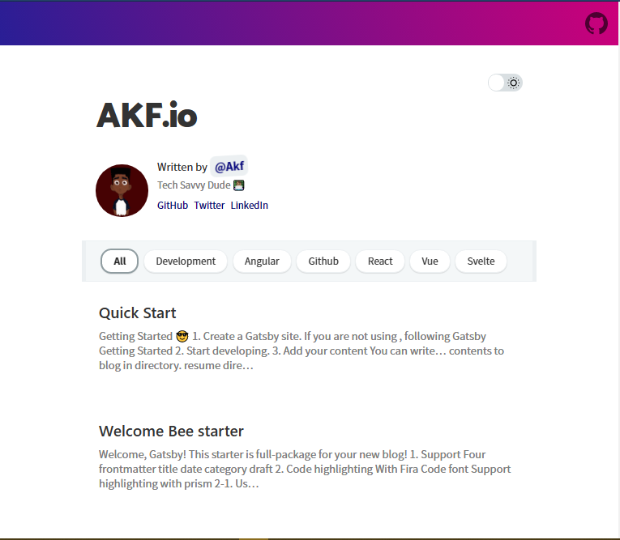

<a href="https://twitter.com/akoji_f">

</a>





```

### ⛑ Structure

```sh
src
├── components // Just component with styling
├── layout // home, post layout
├── pages // routing except post: /(home), /about
├── styles
│   ├── code.scss
│   ├── dark-theme.scss
│   ├── light-theme.scss
│   └── variables.scss
└── templates
    ├── blog-post.js
    └── home.js
```

### 🎨 Style


```sh
src/styles
├── code.scss
├── dark-theme.scss
├── light-theme.scss
└── variables.scss
```
